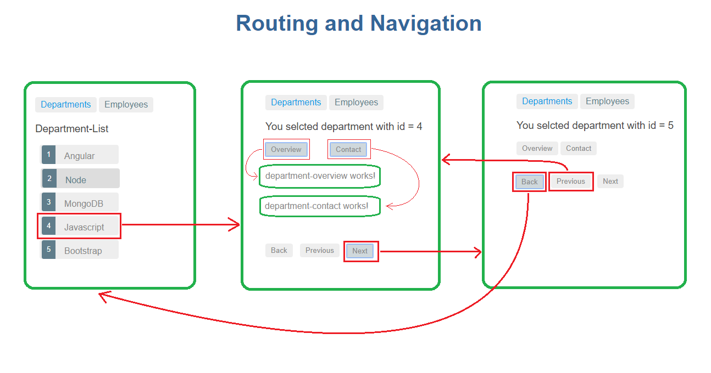

# Routing Demo
Routing system implemented with Angular. 

## Installation
  1. Clone this repositry : `git clone https://github.com/Aktarul/ng-Routing-Demo.git`
  2. Open a terminal in this directory
  3. Navigate to Routing-Demo directory : `cd Routing-Demo`
  4. Install dependencies : `npm install --save`
  5. Run the application : `ng serve`
  6. Visit: `localhost:4200`
  
## Routing Process
### app.component.html
_Departments_ and _Employees_ link will be shown in every route. If a link is selected then corresponding component (defined at path definitions) will be displayed.
```html
<a routerLink="/departments" routerLinkActive="active"> Departments </a>  
<a routerLink="/employees" routerLinkActive="active"> Employees </a>
<router-outlet> </router-outlet>
```

### app-routing.module.ts
**_path definitions_**
```typescript
{ path: '', redirectTo: '/departments', pathMatch: 'full' },
{ path: 'departments', component: DepartmentListComponent },
{
  path: 'departments/:id', component: DepartmentDetailComponent,
  children: [
    { path: 'overview', component: DepartmentOverviewComponent },
    { path: 'contact', component: DepartmentContactComponent }
  ]
},
{ path: 'employees', component: EmployeeListComponent },
{ path: '**', component: PageNotFoundComponent }
```

**_generated components_**
```
DepartmentListComponent,
EmployeeListComponent,
PageNotFoundComponent,
DepartmentDetailComponent,
DepartmentContactComponent,
DepartmentOverviewComponent
```

#### 

## UI Design

